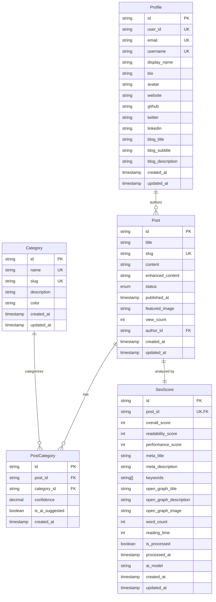

# Dom vlog 데이터베이스 종합 문서

## 목차

1. [개요](#개요)
2. [스키마 설계 원칙](#스키마-설계-원칙)
3. [데이터베이스 ERD](#데이터베이스-erd)
4. [테이블 상세 명세](#테이블-상세-명세)
5. [관계 및 제약조건](#관계-및-제약조건)
6. [인덱스 전략](#인덱스-전략)
7. [데이터 무결성](#데이터-무결성)
8. [성능 최적화](#성능-최적화)
9. [API 서비스 레이어](#api-서비스-레이어)
10. [확장 계획](#확장-계획)

## 개요

Dom vlog는 AI 기능이 내장된 개인 기술 블로그 플랫폼으로, Phase 1에서는 단일 사용자 구조로 설계되었습니다.

### 주요 특징

- **AI 중심 설계**: SEO 점수, 카테고리 추천, 콘텐츠 향상을 위한 AI 데이터 구조
- **확장 가능성**: Phase 2 멀티사용자 확장을 고려한 설계
- **성능 최적화**: 읽기 중심 워크로드에 최적화된 인덱스 설계
- **타입 안전성**: Prisma ORM과 TypeScript 완전 통합

### 기술 스택

- **데이터베이스**: PostgreSQL 13+
- **ORM**: Prisma 6.10.1
- **호스팅**: Supabase (Managed PostgreSQL)
- **타입시스템**: TypeScript 5+ with Prisma Client

## 스키마 설계 원칙

### 1. 단일 책임 원칙 (SRP)

각 테이블은 명확한 단일 목적을 가집니다:

- `profiles`: 사용자/블로거 정보
- `posts`: 블로그 포스트 콘텐츠
- `categories`: 포스트 분류
- `post_categories`: 포스트-카테고리 관계 + AI 메타데이터
- `seo_scores`: AI 생성 SEO 데이터

### 2. 정규화 vs 비정규화 균형

- **3NF 정규화**: 데이터 중복 최소화, 무결성 보장
- **선택적 비정규화**: 읽기 성능을 위한 계산된 필드 (view_count, enhanced_content)

### 3. 확장성 고려

- Phase 1: 단일 사용자 구조
- Phase 2: 멀티사용자로 확장 가능한 구조 (user_id 필드 사전 준비)

### 4. AI 친화적 설계

- AI 추천 신뢰도 저장 (`confidence`)
- AI 처리 상태 추적 (`is_processed`, `processed_at`)
- AI 모델 버전 관리 (`ai_model`)

## 데이터베이스 ERD



## 테이블 상세 명세

### 1. profiles (프로필 테이블)

Phase 1에서는 단일 사용자, Phase 2에서는 다중 사용자를 위한 기본 구조.

| 필드명           | 타입        | 제약조건                      | 설명                           |
| ---------------- | ----------- | ----------------------------- | ------------------------------ |
| id               | TEXT        | PK, DEFAULT gen_random_uuid() | 프로필 고유 ID                 |
| user_id          | TEXT        | UNIQUE, NOT NULL              | 사용자 식별자 (Phase 2 확장용) |
| email            | TEXT        | UNIQUE, NOT NULL              | 이메일 주소                    |
| username         | TEXT        | UNIQUE, NOT NULL              | 사용자명 (URL 친화적)          |
| display_name     | TEXT        | NOT NULL                      | 표시용 이름                    |
| bio              | TEXT        | NULLABLE                      | 자기소개                       |
| avatar           | TEXT        | NULLABLE                      | 프로필 이미지 URL              |
| website          | TEXT        | NULLABLE                      | 개인 웹사이트                  |
| github           | TEXT        | NULLABLE                      | GitHub 프로필                  |
| twitter          | TEXT        | NULLABLE                      | Twitter 프로필                 |
| linkedin         | TEXT        | NULLABLE                      | LinkedIn 프로필                |
| blog_title       | TEXT        | NOT NULL, DEFAULT 'Dom vlog'  | 블로그 제목                    |
| blog_subtitle    | TEXT        | NULLABLE                      | 블로그 부제목                  |
| blog_description | TEXT        | NULLABLE                      | 블로그 설명                    |
| created_at       | TIMESTAMPTZ | NOT NULL, DEFAULT now()       | 생성 시간                      |
| updated_at       | TIMESTAMPTZ | NOT NULL, DEFAULT now()       | 수정 시간                      |

**비즈니스 규칙:**

- Phase 1에서는 단일 레코드만 존재
- username은 URL 슬러그로 사용 가능한 형식
- 소셜 미디어 링크는 선택사항

### 2. categories (카테고리 테이블)

AI 추천 및 수동 분류를 위한 카테고리 관리.

| 필드명      | 타입        | 제약조건                      | 설명                 |
| ----------- | ----------- | ----------------------------- | -------------------- |
| id          | TEXT        | PK, DEFAULT gen_random_uuid() | 카테고리 고유 ID     |
| name        | TEXT        | UNIQUE, NOT NULL              | 카테고리 이름        |
| slug        | TEXT        | UNIQUE, NOT NULL              | URL 친화적 슬러그    |
| description | TEXT        | NULLABLE                      | 카테고리 설명        |
| color       | TEXT        | NULLABLE                      | UI 표시용 색상 (HEX) |
| created_at  | TIMESTAMPTZ | NOT NULL, DEFAULT now()       | 생성 시간            |
| updated_at  | TIMESTAMPTZ | NOT NULL, DEFAULT now()       | 수정 시간            |

**비즈니스 규칙:**

- slug는 kebab-case 형식 (예: 'web-development')
- color는 HEX 색상 코드 형식 (예: '#3B82F6')
- 기본 7개 카테고리 제공

### 3. posts (포스트 테이블)

블로그 포스트의 핵심 정보 및 AI 처리 결과 저장.

| 필드명           | 타입        | 제약조건                      | 설명                     |
| ---------------- | ----------- | ----------------------------- | ------------------------ |
| id               | TEXT        | PK, DEFAULT gen_random_uuid() | 포스트 고유 ID           |
| title            | TEXT        | NOT NULL                      | 포스트 제목              |
| slug             | TEXT        | UNIQUE, NOT NULL              | URL 친화적 슬러그        |
| content          | TEXT        | NOT NULL                      | 원본 마크다운 콘텐츠     |
| excerpt          | TEXT        | NULLABLE                      | 요약 (AI 생성 또는 수동) |
| enhanced_content | TEXT        | NULLABLE                      | AI 향상된 HTML 콘텐츠    |
| status           | post_status | NOT NULL, DEFAULT 'DRAFT'     | 게시 상태                |
| published_at     | TIMESTAMPTZ | NULLABLE                      | 게시 시간                |
| featured_image   | TEXT        | NULLABLE                      | 대표 이미지 URL          |
| view_count       | INTEGER     | NOT NULL, DEFAULT 0           | 조회수                   |
| author_id        | TEXT        | NOT NULL, FK → profiles(id)   | 작성자 ID                |
| created_at       | TIMESTAMPTZ | NOT NULL, DEFAULT now()       | 생성 시간                |
| updated_at       | TIMESTAMPTZ | NOT NULL, DEFAULT now()       | 수정 시간                |

**열거형: post_status**

- `DRAFT`: 초안
- `PUBLISHED`: 게시됨
- `ARCHIVED`: 보관됨

**비즈니스 규칙:**

- slug는 자동 생성 또는 수동 입력
- published_at은 status가 PUBLISHED일 때만 설정
- enhanced_content는 AI 처리 후 저장

### 4. post_categories (포스트-카테고리 관계 테이블)

다대다 관계 구현 및 AI 추천 메타데이터 저장.

| 필드명          | 타입         | 제약조건                      | 설명                       |
| --------------- | ------------ | ----------------------------- | -------------------------- |
| id              | TEXT         | PK, DEFAULT gen_random_uuid() | 관계 고유 ID               |
| post_id         | TEXT         | NOT NULL, FK → posts(id)      | 포스트 ID                  |
| category_id     | TEXT         | NOT NULL, FK → categories(id) | 카테고리 ID                |
| confidence      | DECIMAL(3,2) | NULLABLE                      | AI 추천 신뢰도 (0.00-1.00) |
| is_ai_suggested | BOOLEAN      | NOT NULL, DEFAULT false       | AI 추천 여부               |
| created_at      | TIMESTAMPTZ  | NOT NULL, DEFAULT now()       | 생성 시간                  |

**복합 제약조건:**

- UNIQUE(post_id, category_id): 중복 관계 방지

**비즈니스 규칙:**

- 하나의 포스트는 여러 카테고리 가능
- AI 추천의 경우 confidence 점수 저장
- 수동 할당의 경우 is_ai_suggested = false

### 5. seo_scores (SEO 점수 테이블)

AI 생성 SEO 메타데이터 및 점수 저장.

| 필드명                 | 타입        | 제약조건                         | 설명                  |
| ---------------------- | ----------- | -------------------------------- | --------------------- |
| id                     | TEXT        | PK, DEFAULT gen_random_uuid()    | SEO 점수 고유 ID      |
| post_id                | TEXT        | UNIQUE, NOT NULL, FK → posts(id) | 포스트 ID             |
| overall_score          | INTEGER     | NOT NULL                         | 전체 SEO 점수 (0-100) |
| readability_score      | INTEGER     | NOT NULL                         | 가독성 점수 (0-100)   |
| performance_score      | INTEGER     | NOT NULL                         | 성능 점수 (0-100)     |
| meta_title             | TEXT        | NULLABLE                         | SEO 제목              |
| meta_description       | TEXT        | NULLABLE                         | SEO 설명              |
| keywords               | TEXT[]      | DEFAULT '{}'                     | 키워드 배열           |
| open_graph_title       | TEXT        | NULLABLE                         | OG 제목               |
| open_graph_description | TEXT        | NULLABLE                         | OG 설명               |
| open_graph_image       | TEXT        | NULLABLE                         | OG 이미지 URL         |
| word_count             | INTEGER     | NULLABLE                         | 단어 수               |
| reading_time           | INTEGER     | NULLABLE                         | 읽기 시간 (분)        |
| is_processed           | BOOLEAN     | NOT NULL, DEFAULT false          | AI 처리 완료 여부     |
| processed_at           | TIMESTAMPTZ | NULLABLE                         | AI 처리 완료 시간     |
| ai_model               | TEXT        | NULLABLE                         | 사용된 AI 모델명      |
| created_at             | TIMESTAMPTZ | NOT NULL, DEFAULT now()          | 생성 시간             |
| updated_at             | TIMESTAMPTZ | NOT NULL, DEFAULT now()          | 수정 시간             |

**비즈니스 규칙:**

- 각 포스트당 하나의 SEO 점수 레코드
- 점수는 0-100 범위
- AI 처리 완료 후 is_processed = true 설정

## 관계 및 제약조건

### 외래키 관계

```sql
-- Profile → Post (1:N)
ALTER TABLE posts ADD CONSTRAINT fk_posts_author
    FOREIGN KEY (author_id) REFERENCES profiles(id) ON DELETE CASCADE;

-- Post → PostCategory (1:N)
ALTER TABLE post_categories ADD CONSTRAINT fk_post_categories_post
    FOREIGN KEY (post_id) REFERENCES posts(id) ON DELETE CASCADE;

-- Category → PostCategory (1:N)
ALTER TABLE post_categories ADD CONSTRAINT fk_post_categories_category
    FOREIGN KEY (category_id) REFERENCES categories(id) ON DELETE CASCADE;

-- Post → SeoScore (1:1)
ALTER TABLE seo_scores ADD CONSTRAINT fk_seo_scores_post
    FOREIGN KEY (post_id) REFERENCES posts(id) ON DELETE CASCADE;
```

### CASCADE DELETE 정책

- **Profile 삭제**: 연관된 모든 Post 삭제
- **Post 삭제**: 연관된 PostCategory, SeoScore 삭제
- **Category 삭제**: 연관된 PostCategory 삭제

### 유니크 제약조건

- `profiles`: user_id, email, username
- `categories`: name, slug
- `posts`: slug
- `post_categories`: (post_id, category_id) 복합
- `seo_scores`: post_id

## 인덱스 전략

### 성능 최적화 인덱스

```sql
-- Post 테이블 인덱스
CREATE INDEX idx_posts_status_published ON posts(status, published_at);
CREATE INDEX idx_posts_slug ON posts(slug);
CREATE INDEX idx_posts_author_id ON posts(author_id);

-- SEO Scores 테이블 인덱스
CREATE INDEX idx_seo_scores_overall_score ON seo_scores(overall_score);
CREATE INDEX idx_seo_scores_is_processed ON seo_scores(is_processed);
```

### 인덱스 사용 시나리오

| 인덱스                       | 주요 쿼리 패턴           | 성능 향상 |
| ---------------------------- | ------------------------ | --------- |
| idx_posts_status_published   | 게시된 포스트 목록 조회  | O(log n)  |
| idx_posts_slug               | URL 슬러그로 포스트 조회 | O(log n)  |
| idx_posts_author_id          | 작성자별 포스트 조회     | O(log n)  |
| idx_seo_scores_overall_score | SEO 점수별 정렬          | O(log n)  |
| idx_seo_scores_is_processed  | AI 처리 대기 포스트 조회 | O(log n)  |

## 데이터 무결성

### 참조 무결성

- 모든 외래키에 ON DELETE CASCADE 설정
- 고아 레코드 방지

### 도메인 무결성

- NOT NULL 제약조건 적절히 적용
- DEFAULT 값 설정으로 데이터 일관성 보장
- CHECK 제약조건 (점수 범위 등)

### 엔터티 무결성

- 모든 테이블에 PRIMARY KEY 설정
- UNIQUE 제약조건으로 중복 방지

### 사용자 정의 무결성

- post_status ENUM으로 상태 값 제한
- confidence 범위 제한 (0.00-1.00)
- SEO 점수 범위 제한 (0-100)

## 성능 최적화

### 읽기 최적화

- 복합 인덱스로 조건부 조회 최적화
- 외래키 인덱스로 JOIN 성능 향상

### 쓰기 최적화

- 최소한의 인덱스로 INSERT/UPDATE 성능 보장
- 배치 처리를 위한 bulk operations 지원

### 쿼리 최적화 전략

- **N+1 문제 해결**: Prisma include로 관계 데이터 한 번에 로드
- **페이지네이션**: offset/limit 대신 cursor 기반 페이지네이션 고려
- **캐싱**: Redis를 통한 자주 조회되는 데이터 캐싱

## API 서비스 레이어

### 서비스 패턴

```typescript
// ProfileService: 프로필 관리
- getProfile(): 프로필 조회
- createProfile(): 프로필 생성
- updateProfile(): 프로필 업데이트

// CategoryService: 카테고리 관리
- getAllCategories(): 전체 카테고리 조회
- getCategoriesWithPostCount(): 포스트 수 포함 조회
- createCategory(): 카테고리 생성
- updateCategory(): 카테고리 업데이트
- deleteCategory(): 카테고리 삭제

// PostService: 포스트 관리
- getPostsWithRelations(): 관계 포함 포스트 조회
- getPostById(), getPostBySlug(): 개별 포스트 조회
- createPost(): 포스트 생성
- updatePost(): 포스트 업데이트
- deletePost(): 포스트 삭제
- publishPost(): 포스트 발행
- incrementViewCount(): 조회수 증가

// SeoService: SEO 관리
- getSeoScoreByPostId(): SEO 점수 조회
- upsertSeoScore(): SEO 점수 생성/업데이트

// StatsService: 통계
- getBlogStats(): 블로그 전체 통계
```

### 타입 안전성

- Prisma Client의 완전한 타입 추론
- 커스텀 타입을 통한 확장된 관계 타입
- zod 스키마를 통한 입력 검증

## 확장 계획

### Phase 2: 멀티사용자 지원

#### 스키마 변경

```sql
-- 사용자 테이블 분리
CREATE TABLE users (
    id TEXT PRIMARY KEY,
    email TEXT UNIQUE NOT NULL,
    -- 인증 관련 필드
);

-- 프로필 테이블 수정
ALTER TABLE profiles ADD COLUMN blog_id TEXT UNIQUE;

-- 포스트 테이블에 블로그 컨텍스트 추가
ALTER TABLE posts ADD COLUMN blog_id TEXT REFERENCES profiles(blog_id);
```

#### 신규 테이블

- `user_subscriptions`: 구독 관리
- `blog_settings`: 블로그별 설정
- `user_analytics`: 사용자별 분석 데이터

### Phase 3: 소셜 기능

- `follows`: 팔로우 관계
- `likes`: 좋아요
- `comments`: 댓글
- `notifications`: 알림

### 성능 확장 계획

- **읽기 전용 복제본**: 조회 성능 향상
- **파티셔닝**: 대용량 데이터 처리
- **샤딩**: 글로벌 확장

## 모니터링 및 유지보수

### 성능 지표

- 쿼리 실행 시간 모니터링
- 인덱스 사용률 추적
- 테이블 크기 증가율 모니터링

### 정기 유지보수

- 인덱스 재구성
- 통계 업데이트
- 백업 및 복구 테스트

이 문서는 Dom vlog 프로젝트의 데이터베이스 설계와 구현에 대한 완전한 가이드를 제공하며, 향후 확장과 유지보수의 기준점 역할을 합니다.
