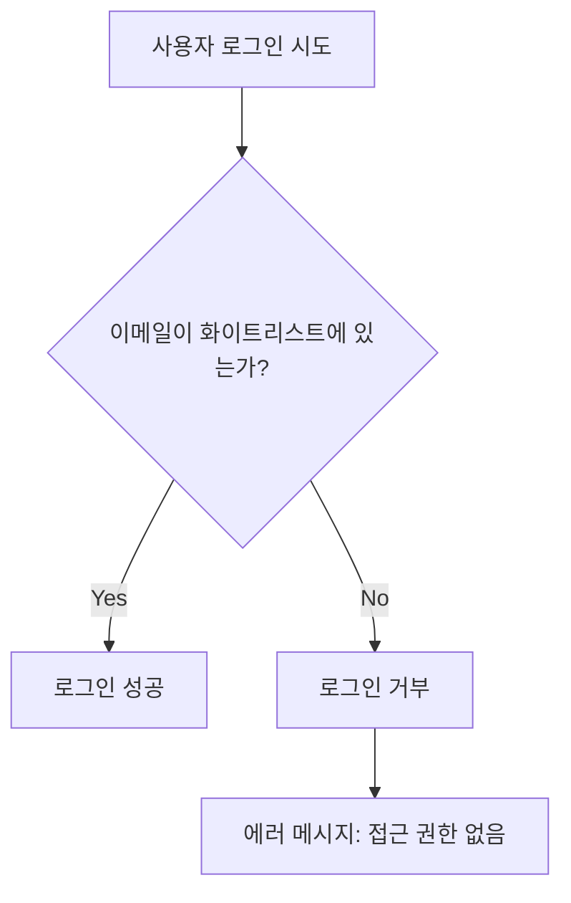

# 개인 블로그 접근 제한 설정 가이드

Dom Vlog는 개인용 블로그로 설계되어 특정 사용자만 접근할 수 있도록 화이트리스트 기반 접근 제어 시스템을 제공합니다.

## 🔒 보안 시스템 개요

### 구현된 보안 기능

- ✅ **이메일 화이트리스트**: 허용된 이메일 주소만 로그인 가능
- ✅ **OAuth 접근 제어**: GitHub/Google 로그인도 화이트리스트 검증
- ✅ **미들웨어 보호**: 인증된 사용자의 경로별 접근 제어
- ✅ **친화적인 거부 페이지**: 미인가 사용자를 위한 안내 페이지

### 보호되는 경로

```
/profile          # 사용자 프로필 관리
/admin            # 관리자 페이지
/dashboard        # 대시보드
/api/posts        # 포스트 관리 API
/api/ai           # AI 기능 API
/api/auth/profile # 프로필 API
/api/auth/logout  # 로그아웃 API
```

### 공개 경로

```
/                 # 메인 페이지 (공개 포스트 열람)
/blog             # 블로그 포스트 목록
/auth/login       # 로그인 페이지
/auth/callback    # OAuth 콜백
/unauthorized     # 접근 거부 안내 페이지
```

## ⚙️ 설정 방법

### 1. 환경변수 설정

`.env.local` 파일에 허용할 이메일 주소를 설정합니다:

```bash
# 단일 사용자 (개인 블로그)
ALLOWED_USER_EMAILS=your-email@example.com

# 복수 사용자 (쉼표로 구분)
ALLOWED_USER_EMAILS=admin@example.com,user1@gmail.com,user2@company.com
```

### 2. 화이트리스트 사용자 추가/제거

#### 사용자 추가

```bash
# 기존: admin@example.com
# 추가 후: admin@example.com,newuser@gmail.com
ALLOWED_USER_EMAILS=admin@example.com,newuser@gmail.com
```

#### 사용자 제거

```bash
# 기존: admin@example.com,olduser@gmail.com,activeuser@gmail.com
# 제거 후: admin@example.com,activeuser@gmail.com
ALLOWED_USER_EMAILS=admin@example.com,activeuser@gmail.com
```

### 3. 서버 재시작

환경변수 변경 후 개발 서버를 재시작해야 적용됩니다:

```bash
npm run dev
```

## 🔄 동작 방식

### 1. 로그인 시 검증



### 2. OAuth 로그인 검증

- GitHub/Google 로그인 성공 후에도 이메일 검증
- 화이트리스트에 없으면 자동으로 로그아웃 처리

### 3. 미들웨어 경로 보호

- 인증이 필요한 경로 접근 시 실시간 검증
- 세션은 있지만 화이트리스트에 없는 사용자는 `/unauthorized`로 리다이렉트

## 🧪 테스트 방법

### 1. 허용된 사용자 테스트

```bash
# 1. 화이트리스트에 이메일 추가
ALLOWED_USER_EMAILS=test@example.com

# 2. 해당 이메일로 로그인 시도
# 3. 성공적으로 로그인되고 보호된 경로 접근 가능
```

### 2. 거부된 사용자 테스트

```bash
# 1. 화이트리스트에 없는 이메일로 로그인 시도
# 2. "이 블로그에 접근할 권한이 없습니다" 메시지 확인
# 3. /unauthorized 페이지로 리다이렉트 확인
```

### 3. OAuth 로그인 테스트

```bash
# 1. GitHub/Google로 로그인 시도
# 2. OAuth 인증 성공 후 이메일 검증
# 3. 화이트리스트에 없으면 접근 거부
```

## 🛡️ 보안 고려사항

### 1. 환경변수 보안

- `.env.local` 파일을 반드시 `.gitignore`에 포함
- 프로덕션 환경에서는 Vercel 환경변수 사용
- 이메일 주소에 공백이나 특수문자 포함 금지

### 2. 세션 관리

- Supabase의 기본 세션 만료 시간 사용
- 미들웨어에서 실시간 세션 검증
- 로그아웃 시 완전한 세션 정리

### 3. 에러 처리

- 보안상 민감한 정보 노출 방지
- 일반적인 접근 거부 메시지 사용
- 로그에 보안 이벤트 기록

## 🔧 고급 설정

### 1. 도메인 기반 제한

필요시 특정 도메인의 이메일만 허용하도록 확장 가능:

```typescript
// lib/auth/auth-service.ts에서 확장
function isAllowedUser(email: string): boolean {
  const allowedDomains = process.env.ALLOWED_DOMAINS?.split(',') || [];
  const emailDomain = email.split('@')[1];

  // 개별 이메일 검증
  if (isInWhitelist(email)) return true;

  // 도메인 검증
  return allowedDomains.includes(emailDomain);
}
```

### 2. 역할 기반 접근 제어 (향후 확장)

```typescript
// 데이터베이스 스키마에 역할 필드 추가
model Profile {
  id          String @id @default(cuid())
  email       String @unique
  role        String @default("viewer") // admin, editor, viewer
  // ...
}
```

### 3. 임시 접근 토큰 (게스트 접근)

```typescript
// 특정 포스트에 대한 임시 접근 링크 생성
// /blog/post-slug?token=temporary-access-token
```

## 📊 모니터링

### 1. 접근 시도 로그

서버 로그에서 접근 거부 이벤트 확인:

```bash
# 개발 환경
npm run dev
# 콘솔에서 "접근 권한 없음" 로그 확인

# 프로덕션 환경
# Vercel Functions 로그에서 확인
```

### 2. Supabase 인증 로그

Supabase Dashboard > Authentication > Logs에서:

- 로그인 성공/실패 이벤트
- OAuth 인증 시도
- 세션 생성/만료

## ✅ 체크리스트

- [ ] `ALLOWED_USER_EMAILS` 환경변수 설정
- [ ] 허용된 사용자로 로그인 테스트
- [ ] 거부된 사용자로 로그인 시도 테스트
- [ ] OAuth 로그인 화이트리스트 검증 테스트
- [ ] 보호된 경로 접근 제한 확인
- [ ] `/unauthorized` 페이지 확인
- [ ] 프로덕션 환경변수 설정 (배포 시)

## 🚨 주의사항

1. **환경변수 누락**: `ALLOWED_USER_EMAILS`가 설정되지 않으면 모든 접근이 거부됩니다
2. **이메일 대소문자**: 자동으로 소문자로 변환되어 비교됩니다
3. **공백 제거**: 이메일 주소의 앞뒤 공백은 자동으로 제거됩니다
4. **즉시 적용**: 환경변수 변경은 서버 재시작 후 적용됩니다

이제 Dom Vlog는 완전한 개인 블로그로 보안이 설정되었습니다! 🎉
